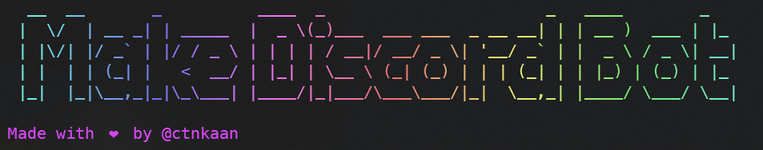

	
	<h1 align="center"> Make Discord Bot </h1>
		

			<b>This is the main repository of the Make Discord Bot CLI. </b> 
		
  

## About :

Make Discord Bot is a Command Line Interface that allows for easy access to Discord.js bot templates. It is developed using Node.js and has options of JavaScript and TypeScript templates.

## Example Usage

-> `npx make-discord-bot`

## Prerequisites

### System requirement

1. Any system with basic configuration.
2. Operating System : Windows / Linux / Mac

### Software requirement

1. Node.JS
2. Command Line

### Skill requirement

1. Git & Github
2. Node.js
3. Discord.js
4. TypeScript
5. Command Line

## Running the Project Locally

### Setting Up The Application

1. Clone the project with `git clone` and `cd` into it
1. Rename the `dotenv` file to : `.env`
1. Get your secret key from [Discord Developer Portal](https://discord.com/developers/applications) (make a bot for your app) and put it in the `.env` file as the value for `DISCORD_TOKEN`
1. Run `npm install`
1. You are good to go! Now you can start the project by typing `node index.js`

## Contributors :

